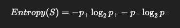
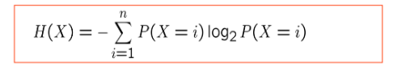
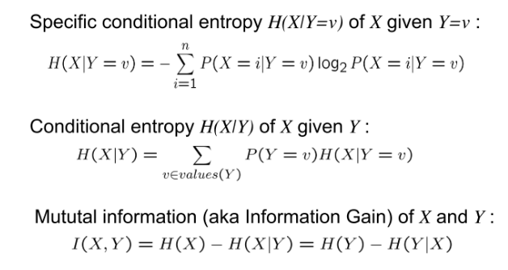
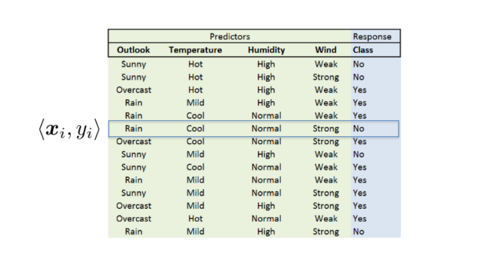
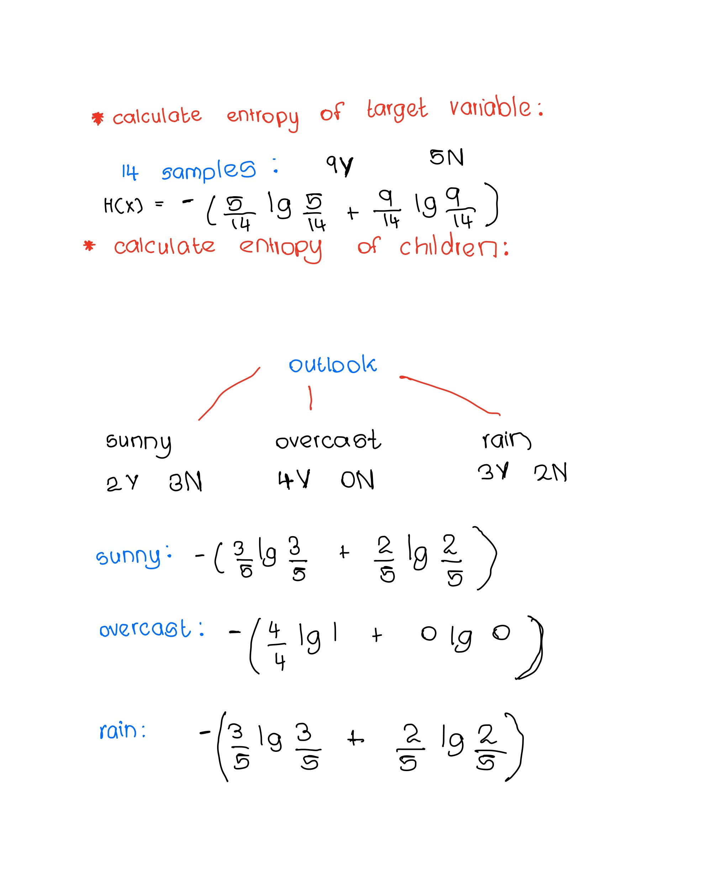
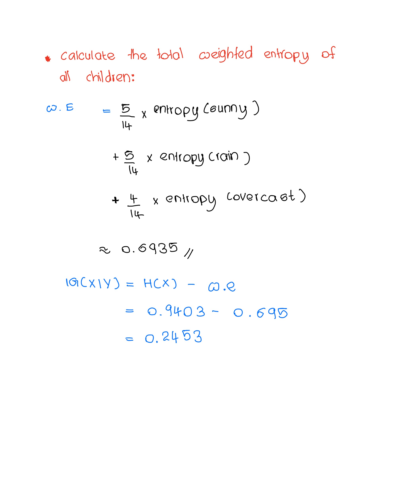
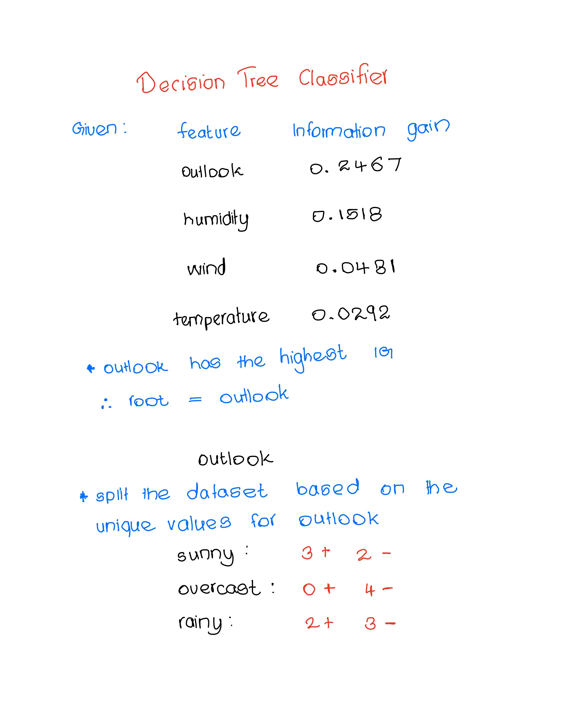
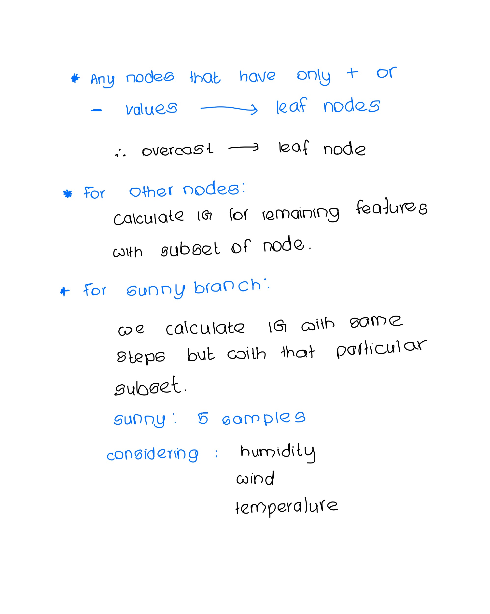
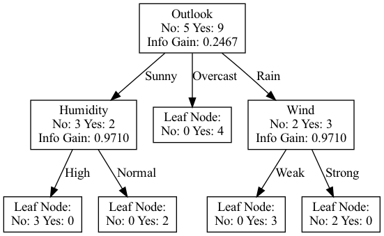

# Report

mcperera

## Ranking features using entropy

### Entropy and Information Gain

Good data is an important factor for any machine learning model. However, practically the amount of data we can collect is limited and therefore it is best to understand and inspect our data to identify its properties.

Entropy is a fundamental concept in information theory and is particularly useful for feature selection and for decision tree algorithms. Information gain uses entropy to rank features based on the uncertainty introduced by each feature with respect to the target.

Therefore, this metric as the name implies tells us how much information or the degree of correlation between a input feature to the target variable. For example, an input feature with a high variation will have a higher information gain if the target variable also has a high variation, and lower if there isn't much variation with the target variable.

Entropy is a fundamental concept in information theory and plays a crucial role in various areas of machine learning, particularly in feature selection and decision tree algorithms. Understanding entropy and how it relates to information gain can help in effectively ranking features, assessing the quality of your data, and making informed decisions about which features to include in your models. Let's break down these concepts step by step.

### Formulas for Entropy and Information Gain

The formula to compute entropy for binary classification is defined below:



Where:

- p+: percentage of instances in class A
- p-: percentage of instances in class B

If we were to take a closer look at this basic formula we can see the conditions for:

- High Entropy: When both classes are equal the uncertainty is high and close to the max value of 1
- Low Entropy: When a single class dominates then the entropy is low and closer to 0

And for a multi-class problem it can be computed as:



Where:

- n: number of classes

We use entropy to measure information gain:



Where:

- X: input variable X
- Y: target label Y

Therefore, we can use the above formula to see how important each input feature is in relation to our target variable and thereby as the metric to rank our features.

### A practical example

Lets consider the following dataset:



Using the formula above I have computed information gain manually for one feature:




Based on this logic, I can write a simple generic function to calculate the entropy for our input features given we have a binary classification problem.

### Implementing information gain and entropy in python

The above data is stored programmatically as a csv file.

To analyze and manipulate our dataset we can use pandas to read our file into a DataFrame object.

Once we have the dataset loaded into our memory we can then implement the following algorithm to compute entropy based on the steps we used above to calculate it manually:

``` python
def get_info_gain(target_column_name: str, data_frame: pd.DataFrame) -> dict:
    """
    Compute the Information Gain for each input feature relative to the target variable.
    This algorithm assumes it the dataset is a binary classification problem.
    
    Parameters:
    - target_column_name: Name of the column with our target variables
    - data_frame: This will be the input dataset
    
    Returns:
    - dict: key: Name of input feature value: Information gain  for input feature
    """
    # We first extract the unique values in our target column
    # Since this algorithm is designed for a binary classification problem it assumes there will be 
    # 2 unique values, in addition we also take the occurrence of each target variable    
    target_labels, counts = np.unique(data_frame[target_column_name], return_counts=True)
    if counts.size() != 2:
        raise AssertionError(f"Not a binary class problem. Has the following target values: {target_labels}")
    entropy = compute_binary_entropy(counts[0], counts[1])
    # This is the entropy of the dataset
    print(f'Parent entropy: {entropy}')
    info_gain_map = {}
     # Iterate through each feature
    for input_feature_x in data_frame.columns.tolist():
        if input_feature_x != target_column_name:
            # Create crosstab between the feature and the target
            crosstab = pd.crosstab(data_frame[input_feature_x], data_frame[target_column_name])
            info_gain = 0
            # Iterate over each unique value and calculate the entropy one by one
            for unique_value, row in crosstab.iterrows():
                class_0_count = row[target_labels[0]]
                class_1_count = row[target_labels[1]]
                print(f'For {unique_value}:\n Num of positive examples: {class_0_count} \n Num of negative examples: {class_1_count}')
                child_entropy = compute_binary_entropy(class_0_count, class_1_count)
                print(f'Computed value of child entropy for label, {unique_value} : {child_entropy}')
                weighted_entropy = 0
                if child_entropy != 0:
                    weighted_entropy = child_entropy * (class_0_count+class_1_count)/(counts[0]+counts[1])
                info_gain += weighted_entropy
                print(f'Computed value of weighted child entropy for label, {unique_value} : {weighted_entropy}')
            info_gain = entropy - info_gain
            info_gain_map[input_feature_x] = info_gain
    return info_gain_map

def compute_binary_entropy(num_instances_class_0, num_instances_class_1):
    """
        Compute the entropy given the number of positive examples to negative examples
        
        Parameters:
        - num_instances_class_0: number of instances in class 0
        - num_instances_class_1: number of instances in class 1
        
        Return:
        - The entropy for a 2 class problem
    """
    # In the case we have a 0 we know for sure that the probability should be 0
    # This also avoid NaN errors
    if num_instances_class_0 == 0 or num_instances_class_1 == 0:
        return 0
    probability_class_0 = num_instances_class_0/(num_instances_class_0+num_instances_class_1)
    probability_class_1 = num_instances_class_1/(num_instances_class_0+num_instances_class_1)
    return -(probability_class_0*np.log2(probability_class_0)+probability_class_1*np.log2(probability_class_1))
```

### Results

Applying the dataset on the above function gives us:

| Input Feature | Information Gain |
|---------------|------------------|
| Outlook       | 0.2467          |
| Temperature   | 0.0292          |
| Humidity      | 0.1518          |
| Wind          | 0.0481          |

### Choosing the best features based on information gain

From our results, we can verify that our program is working as intended as the calculation for outlook aligns  with our manual calculation.

Outlook and Humidity have higher values for information gain which also correspond to a greater reduction in entropy compared to Temperature or Wind. This means they have a stronger correlation to the target variable compared to the other two.

Therefore ideally, it is best to prioritize features that have higher information gain over those that are lower to improve performance and reduce overall noise.

## Decision Tree Classifiers

### Building a decision tree based on information gain

Based on this we can determine the root for our decision tree based on the information gain method.

Similar to the previous approach I did the first few steps manually to understand the logic needed to implement it programmatically:




We need to keep splitting at non-leaf nodes till we have no more features to split on or we end up with all leaf nodes based on the particular subset of data at that node.

### Using graphviz for visualization

To render this image I used the graphviz library and created a node object that will hold the necessary information at each split. We can then use a tree traversal method from the root to then render the tree.

``` python
class Node:
    def __init__(self, label, class_a_samples, class_b_samples, info_gain=None, children=None, class_a_label="Class A", class_b_label="Class B"):
        """
        Initializes a node in the decision tree.

        Parameters:
        - label (str): The label or decision at this node.
        - class_a_samples (int): Number of samples for class A at this node.
        - class_b_samples (int): Number of samples for class B at this node.
        - info_gain (float): Information Gain at this node.
        - children (list of tuples): List of tuples (edge_label, child_node).
        - class_a_label (str): The label for class A.
        - class_b_label (str): The label for class B.
        """
        self.label = label
        self.class_a_samples = class_a_samples
        self.class_b_samples = class_b_samples
        self.info_gain = info_gain
        self.children = children if children is not None else []
        self.class_a_label = class_a_label
        self.class_b_label = class_b_label

    def add_child(self, edge_label, child_node):
        """
        Adds a child to the node.

        Parameters:
        - edge_label (str): Label on the edge leading to the child.
        - child_node (Node): The child node to add.
        """
        self.children.append((edge_label, child_node))

def traverse(node, dot, parent_id=None, edge_label=''):
    """
    Traverse the tree node by node and build the graph in Graphviz by recursively visiting each node once.
    """
    node_id = str(id(node))
    # Create the label for the node with dynamic class labels
    node_label = f"{node.label}\n{node.class_a_label}: {node.class_a_samples} {node.class_b_label}: {node.class_b_samples}"
    if node.info_gain is not None:
        node_label += f"\nInfo Gain: {node.info_gain:.4f}"
    # Add the node to the graph
    dot.node(node_id, label=node_label, shape='box')
    # If this is not the root node, connect it to its parent
    if parent_id is not None:
        dot.edge(parent_id, node_id, label=edge_label)
    # Recursively add child nodes
    for child_edge_label, child_node in node.children:
        traverse(child_node, dot, parent_id=node_id, edge_label=child_edge_label)

def render_tree(root_node, output_filename='decision_tree'):
    """
    Traverses the tree starting from the root node and renders it using Graphviz.

    Parameters:
    - root_node (Node): The root node of the decision tree.
    - output_filename (str): The filename for the output image.
        
    Returns:
    - Saves the rendered image as an output file.
    """
    dot = Digraph(comment='Information Gain Decision Tree')
    # Start traversal from the root node
    traverse(root_node, dot)
    # Render the graph to a file
    dot.render(filename=output_filename, format='png', cleanup=True)
    print(f"Decision tree rendered and saved as {output_filename}.png")
```

### Rendering the tree recursively from the root

Now we need to build a tree based on our initial dataset and combine it with our function to compute information gain:

``` python
def build_decision_tree(data, target_column_name, features, parent_node=None, class_labels=None):
    """
    Recursively builds a decision tree based on information gain.

    Parameters:
    - data: The dataset (pandas DataFrame).
    - target_column_name: The name of the target variable column.
    - features: List of features to consider for splitting.
    - parent_node: The parent node in the tree (used in recursion).
    - class_labels: Optional tuple containing labels for the binary classes (class_a, class_b).

    Returns:
    - Node: The root node of the decision tree.
    """
    # Determine the labels for the classes
    target_values = data[target_column_name]
    unique_classes = target_values.unique()    
    # Assign class labels dynamically, if not provided
    if class_labels is None:
        class_a_label, class_b_label = unique_classes[0], unique_classes[1]
        class_labels = (class_a_label, class_b_label)
    else:
        class_a_label, class_b_label = class_labels    
    # Count the number of samples in each class
    class_a_samples = (target_values == class_a_label).sum()
    class_b_samples = (target_values == class_b_label).sum()    
    # If all samples are in one class, create a leaf node
   # If all samples are in one class, create a leaf node
    if len(unique_classes) == 1:
        if unique_classes[0] == class_a_label:
            return Node(label="Leaf Node:", class_a_samples=class_a_samples, class_b_samples=0, class_a_label=class_a_label, class_b_label=class_b_label)
        else:
            return Node(label="Leaf Node:", class_a_samples=0, class_b_samples=class_b_samples, class_a_label=class_a_label, class_b_label=class_b_label) # If no features left, return a leaf node with majority class
    if len(features) == 0:
        class_a_samples = (target_values == class_a_label).sum()
        class_b_samples = (target_values == class_b_label).sum()
        return Node(label="Leaf Node:", class_a_samples=class_a_samples, class_b_samples=class_b_samples, class_a_label=class_a_label, class_b_label=class_b_label)
    # Compute information gain for all features
    info_gain_map = get_info_gain(target_column_name, data[features + [target_column_name]])    
    # Select the feature with the highest information gain
    best_feature = max(info_gain_map, key=info_gain_map.get)
    best_info_gain = info_gain_map[best_feature]    
    # Create the root node with the best feature
    root = Node(
        label=best_feature,
        class_a_samples=class_a_samples,
        class_b_samples=class_b_samples,
        info_gain=best_info_gain,
        class_a_label=class_a_label,
        class_b_label=class_b_label
    )
    # Remove the best feature from the list of features
    remaining_features = [feat for feat in features if feat != best_feature]    
    # Get unique values of the best feature
    feature_values = data[best_feature].unique()    
    # For each value of the best feature, create child nodes
    for value in feature_values:
        subset = data[data[best_feature] == value]        
        # Recursively build the subtree for this subset
        child_node = build_decision_tree(subset, target_column_name, remaining_features, parent_node=root, class_labels=class_labels)        
        # Add the child node to the root node
        root.add_child(edge_label=str(value), child_node=child_node)    
    return root
```

We can then build the tree by passing our dataset with all of its input features:

``` python
features = weather_data.columns.tolist()
root_node = dependencies.build_decision_tree(weather_data, "Prediction", features)
dependencies.render_tree(root_node)
```

### Rendered decision tree

Our rendered tree will contain the following visual information:

- Nodes:
  - number of positive samples
  - number of negative samples
  - the input variable used to split the subset
  - the computed information gain value at the split
- Edges:
  - Value used to determine the split



### Observations

The tree's nodes are split till we end up with pure leaf nodes belonging to a single target class.

Based on this tree we can make the following assumptions:

- If the outlook is overcast the decision tree indicates that it is a strong indicator of playing in that weather.
- Similarly based on our tree if it is raining and there is also strong wind, it is a negative indicator of playing in the current weather and if the wind is not as strong it is a positive indicator of playing tennis on that day.

Traversing the node based on the split provides info regarding the necessary splits.
