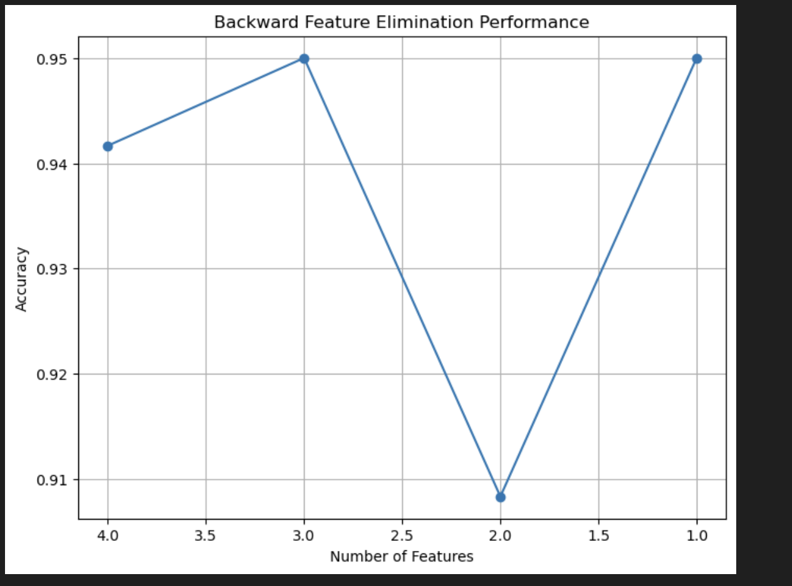

# Feature Selection

## Installation guide

### Using Conda

Install conda or minconda to your system.

Then you can initialize the exact environment I used using the dependencies in my environment.yml file in the root directory:

``` bash
    conda env create -f environment.yml
```

This will create a environment named efficientai-mcperera that you can activate or you can switch the name before installing the environment.

### Using pip

You can also use the requirements.txt file to initialize the required libraries

``` bash
    python -m venv myenv
    source myenv/bin/activate  
    pip install -r requirements.txt
```

## Folder structure

- ./feature_ranking.ipynb: Contains the analysis for measuring entropy and using information gain to build a decision tree
- ./neural_network.ipynb: Contains the analysis of the iris data on a neural network
- ./dependencies.py: Required dependencies to run both interactive notebooks
- ./imgs: List of all images used for the mark down rendering and report
- ./datasets: CSV datasets used as input

## Ranking features using entropy

### Entropy and Information Gain

Good data is an important factor for any machine learning model. However, practically the amount of data we can collect is limited and therefore it is best to understand and inspect our data to identify its properties.

Entropy is a fundamental concept in information theory and is particularly useful for feature selection and for decision tree algorithms. Information gain uses entropy to rank features based on the uncertainty introduced by each feature with respect to the target.

Therefore, this metric as the name implies tells us how much information or the degree of correlation between a input feature to the target variable. For example, an input feature with a high variation will have a higher information gain if the target variable also has a high variation, and lower if there isn't much variation with the target variable.

Entropy is a fundamental concept in information theory and plays a crucial role in various areas of machine learning, particularly in feature selection and decision tree algorithms. Understanding entropy and how it relates to information gain can help in effectively ranking features, assessing the quality of your data, and making informed decisions about which features to include in your models. Let's break down these concepts step by step.

### Formulas for Entropy and Information Gain

The formula to compute entropy for binary classification is defined below:


Where:

- p+: percentage of instances in class A
- p-: percentage of instances in class B

If we were to take a closer look at this basic formula we can see the conditions for:

- High Entropy: When both classes are equal the uncertainty is high and close to the max value of 1
- Low Entropy: When a single class dominates then the entropy is low and closer to 0

And for a multi-class problem it can be computed as:


Where:

- n: number of classes

We use entropy to measure information gain:


Where:

- X: input variable X
- Y: target label Y

Therefore, we can use the above formula to see how important each input feature is in relation to our target variable and thereby as the metric to rank our features.

### A practical example

Lets consider the following dataset:


Using the formula above I have computed information gain manually for one feature:


Based on this logic, I can write a simple generic function to calculate the entropy for our input features given we have a binary classification problem.

### Implementing information gain and entropy in python

The above data is stored programmatically as a csv file.

To analyze and manipulate our dataset we can use pandas to read our file into a DataFrame object.

Once we have the dataset loaded into our memory we can then implement the following algorithm to compute entropy based on the steps we used above to calculate it manually:

``` python
def get_info_gain(target_column_name: str, data_frame: pd.DataFrame) -> dict:
    """
    Compute the Information Gain for each input feature relative to the target variable.
    This algorithm assumes it the dataset is a binary classification problem.
    
    Parameters:
    - target_column_name: Name of the column with our target variables
    - data_frame: This will be the input dataset
    
    Returns:
    - dict: key: Name of input feature value: Information gain  for input feature
    """
    # We first extract the unique values in our target column
    # Since this algorithm is designed for a binary classification problem it assumes there will be 
    # 2 unique values, in addition we also take the occurrence of each target variable    
    target_labels, counts = np.unique(data_frame[target_column_name], return_counts=True)
    if counts.size() != 2:
        raise AssertionError(f"Not a binary class problem. Has the following target values: {target_labels}")
    entropy = compute_binary_entropy(counts[0], counts[1])
    # This is the entropy of the dataset
    print(f'Parent entropy: {entropy}')
    info_gain_map = {}
     # Iterate through each feature
    for input_feature_x in data_frame.columns.tolist():
        if input_feature_x != target_column_name:
            # Create crosstab between the feature and the target
            crosstab = pd.crosstab(data_frame[input_feature_x], data_frame[target_column_name])
            info_gain = 0
            # Iterate over each unique value and calculate the entropy one by one
            for unique_value, row in crosstab.iterrows():
                class_0_count = row[target_labels[0]]
                class_1_count = row[target_labels[1]]
                print(f'For {unique_value}:\n Num of positive examples: {class_0_count} \n Num of negative examples: {class_1_count}')
                child_entropy = compute_binary_entropy(class_0_count, class_1_count)
                print(f'Computed value of child entropy for label, {unique_value} : {child_entropy}')
                weighted_entropy = 0
                if child_entropy != 0:
                    weighted_entropy = child_entropy * (class_0_count+class_1_count)/(counts[0]+counts[1])
                info_gain += weighted_entropy
                print(f'Computed value of weighted child entropy for label, {unique_value} : {weighted_entropy}')
            info_gain = entropy - info_gain
            info_gain_map[input_feature_x] = info_gain
    return info_gain_map

def compute_binary_entropy(num_instances_class_0, num_instances_class_1):
    """
        Compute the entropy given the number of positive examples to negative examples
        
        Parameters:
        - num_instances_class_0: number of instances in class 0
        - num_instances_class_1: number of instances in class 1
        
        Return:
        - The entropy for a 2 class problem
    """
    # In the case we have a 0 we know for sure that the probability should be 0
    # This also avoid NaN errors
    if num_instances_class_0 == 0 or num_instances_class_1 == 0:
        return 0
    probability_class_0 = num_instances_class_0/(num_instances_class_0+num_instances_class_1)
    probability_class_1 = num_instances_class_1/(num_instances_class_0+num_instances_class_1)
    return -(probability_class_0*np.log2(probability_class_0)+probability_class_1*np.log2(probability_class_1))
```

### Results

Applying the dataset on the above function gives us:

| Input Feature | Information Gain |
|---------------|------------------|
| Outlook       | 0.2467          |
| Temperature   | 0.0292          |
| Humidity      | 0.1518          |
| Wind          | 0.0481          |

### Choosing the best features based on information gain

From our results, we can verify that our program is working as intended as the calculation for outlook aligns  with our manual calculation.

Outlook and Humidity have higher values for information gain which also correspond to a greater reduction in entropy compared to Temperature or Wind. This means they have a stronger correlation to the target variable compared to the other two.

Therefore ideally, it is best to prioritize features that have higher information gain over those that are lower to improve performance and reduce overall noise.

## Decision Tree Classifiers

### Building a decision tree based on information gain

Based on this we can determine the root for our decision tree based on the information gain method.

Similar to the previous approach I did the first few steps manually to understand the logic needed to implement it programmatically:


We need to keep splitting at non-leaf nodes till we have no more features to split on or we end up with all leaf nodes based on the particular subset of data at that node.

### Using graphviz for visualization

To render this image I used the graphviz library and created a node object that will hold the necessary information at each split. We can then use a tree traversal method from the root to then render the tree.

``` python
class Node:
    def __init__(self, label, class_a_samples, class_b_samples, info_gain=None, children=None, class_a_label="Class A", class_b_label="Class B"):
        """
        Initializes a node in the decision tree.

        Parameters:
        - label (str): The label or decision at this node.
        - class_a_samples (int): Number of samples for class A at this node.
        - class_b_samples (int): Number of samples for class B at this node.
        - info_gain (float): Information Gain at this node.
        - children (list of tuples): List of tuples (edge_label, child_node).
        - class_a_label (str): The label for class A.
        - class_b_label (str): The label for class B.
        """
        self.label = label
        self.class_a_samples = class_a_samples
        self.class_b_samples = class_b_samples
        self.info_gain = info_gain
        self.children = children if children is not None else []
        self.class_a_label = class_a_label
        self.class_b_label = class_b_label

    def add_child(self, edge_label, child_node):
        """
        Adds a child to the node.

        Parameters:
        - edge_label (str): Label on the edge leading to the child.
        - child_node (Node): The child node to add.
        """
        self.children.append((edge_label, child_node))

def traverse(node, dot, parent_id=None, edge_label=''):
    """
    Traverse the tree node by node and build the graph in Graphviz by recursively visiting each node once.
    """
    node_id = str(id(node))
    # Create the label for the node with dynamic class labels
    node_label = f"{node.label}\n{node.class_a_label}: {node.class_a_samples} {node.class_b_label}: {node.class_b_samples}"
    if node.info_gain is not None:
        node_label += f"\nInfo Gain: {node.info_gain:.4f}"
    # Add the node to the graph
    dot.node(node_id, label=node_label, shape='box')
    # If this is not the root node, connect it to its parent
    if parent_id is not None:
        dot.edge(parent_id, node_id, label=edge_label)
    # Recursively add child nodes
    for child_edge_label, child_node in node.children:
        traverse(child_node, dot, parent_id=node_id, edge_label=child_edge_label)

def render_tree(root_node, output_filename='decision_tree'):
    """
    Traverses the tree starting from the root node and renders it using Graphviz.

    Parameters:
    - root_node (Node): The root node of the decision tree.
    - output_filename (str): The filename for the output image.
        
    Returns:
    - Saves the rendered image as an output file.
    """
    dot = Digraph(comment='Information Gain Decision Tree')
    # Start traversal from the root node
    traverse(root_node, dot)
    # Render the graph to a file
    dot.render(filename=output_filename, format='png', cleanup=True)
    print(f"Decision tree rendered and saved as {output_filename}.png")
```

### Rendering the tree recursively from the root

Now we need to build a tree based on our initial dataset and combine it with our function to compute information gain:

``` python
def build_decision_tree(data, target_column_name, features, parent_node=None, class_labels=None):
    """
    Recursively builds a decision tree based on information gain.

    Parameters:
    - data: The dataset (pandas DataFrame).
    - target_column_name: The name of the target variable column.
    - features: List of features to consider for splitting.
    - parent_node: The parent node in the tree (used in recursion).
    - class_labels: Optional tuple containing labels for the binary classes (class_a, class_b).

    Returns:
    - Node: The root node of the decision tree.
    """
    # Determine the labels for the classes
    target_values = data[target_column_name]
    unique_classes = target_values.unique()    
    # Assign class labels dynamically, if not provided
    if class_labels is None:
        class_a_label, class_b_label = unique_classes[0], unique_classes[1]
        class_labels = (class_a_label, class_b_label)
    else:
        class_a_label, class_b_label = class_labels    
    # Count the number of samples in each class
    class_a_samples = (target_values == class_a_label).sum()
    class_b_samples = (target_values == class_b_label).sum()    
    # If all samples are in one class, create a leaf node
   # If all samples are in one class, create a leaf node
    if len(unique_classes) == 1:
        if unique_classes[0] == class_a_label:
            return Node(label="Leaf Node:", class_a_samples=class_a_samples, class_b_samples=0, class_a_label=class_a_label, class_b_label=class_b_label)
        else:
            return Node(label="Leaf Node:", class_a_samples=0, class_b_samples=class_b_samples, class_a_label=class_a_label, class_b_label=class_b_label) # If no features left, return a leaf node with majority class
    if len(features) == 0:
        class_a_samples = (target_values == class_a_label).sum()
        class_b_samples = (target_values == class_b_label).sum()
        return Node(label="Leaf Node:", class_a_samples=class_a_samples, class_b_samples=class_b_samples, class_a_label=class_a_label, class_b_label=class_b_label)
    # Compute information gain for all features
    info_gain_map = get_info_gain(target_column_name, data[features + [target_column_name]])    
    # Select the feature with the highest information gain
    best_feature = max(info_gain_map, key=info_gain_map.get)
    best_info_gain = info_gain_map[best_feature]    
    # Create the root node with the best feature
    root = Node(
        label=best_feature,
        class_a_samples=class_a_samples,
        class_b_samples=class_b_samples,
        info_gain=best_info_gain,
        class_a_label=class_a_label,
        class_b_label=class_b_label
    )
    # Remove the best feature from the list of features
    remaining_features = [feat for feat in features if feat != best_feature]    
    # Get unique values of the best feature
    feature_values = data[best_feature].unique()    
    # For each value of the best feature, create child nodes
    for value in feature_values:
        subset = data[data[best_feature] == value]        
        # Recursively build the subtree for this subset
        child_node = build_decision_tree(subset, target_column_name, remaining_features, parent_node=root, class_labels=class_labels)        
        # Add the child node to the root node
        root.add_child(edge_label=str(value), child_node=child_node)    
    return root
```

We can then build the tree by passing our dataset with all of its input features:

``` python
features = weather_data.columns.tolist()
root_node = dependencies.build_decision_tree(weather_data, "Prediction", features)
dependencies.render_tree(root_node)
```

### Rendered decision tree

Our rendered tree will contain the following visual information:

- Nodes:
  - number of positive samples
  - number of negative samples
  - the input variable used to split the subset
  - the computed information gain value at the split
- Edges:
  - Value used to determine the split


### Observations

The tree's nodes are split till we end up with pure leaf nodes belonging to a single target class.

Based on this tree we can make the following assumptions:

- If the outlook is overcast the decision tree indicates that it is a strong indicator of playing in that weather.
- Similarly based on our tree if it is raining and there is also strong wind, it is a negative indicator of playing in the current weather and if the wind is not as strong it is a positive indicator of playing tennis on that day.

Traversing the node based on the split provides info regarding the necessary splits.

## Neural network building and feature contribution analysis

### Iris dataset

For the implementation of the Neural Network, the 'Iris plants dataset' that is available in the python scikit-learn library will be used. It has 4 features with 150 samples, with 50 samples for each class. Therefore, this is a 3 class classification problem.

We can load the dataset easily using a single command. We then split our dataset for training and testing. We will train our network on 80% of this dataset and we will test its corresponding performance on the 20% that we did not use to test the accuracy of our model.

Sci-kit learn has a command that allows us to split our dataset by passing this ratio.

### Data pre-processing

Inspecting our dataset reveals that the we have 4 features with single decimal floating point values. However, they have different scales. For example, we can see from the head of our dataset  that sepal length ranges from 4.6 to 5.1 while petal width is set to 0.2. When each feature has different scaling it can cause the features with higher values to dominate the weights over features that might be more important but have a lower scale. Therefore, we need to perform data pre-processing to ensure our values are standardized.


To perform standardization we can use different methods:

- StandardScalar: Transformed data has a mean of 0 and a standard deviation of 1
- MinMaxScaler: Transformed data ranges between [0, 1]

The min max scalar can be more sensitive to outliers as it uses them for the minimum and maximum values. I opted for the standard scalar to transform the dataset.


### One hot encode the target

If we inspect our target variables we see that our labels are codes as 0, 1, 2 where:

- 0: Iris Setosa
- 1: Iris Versicolor
- 2: Iris Virginica

We can use one hot encoding which converts our labels to a binary representation to:

- To avoid ordinal relationship which implies 1 > 2
- Since this is a multi  class classification problem, our output layer should have one neuron for each class which would be 3 neurons in this case.
- If we want to use the softmax activation function, our loss function will throw an error if there is an incompatible shape between the prediction and target.

### Creating the neural network

A neural network consists of the input layer, the output layer and the hidden layers in between.

In convolution neural networks, a filter is applied across a region and therefore subsequent layers have less neurons.

However, for this problem and to keep things manageable since I will be coding the layers from scratch, I opted to use fully connected hidden layers.

Since we know our output layer will consist of 3 neurons, our last hidden layer needs to map to this neuron.

The first thing we have to do is initialize the parameters for the neural network.

Proper weight initialization is important for several reasons:

- For faster convergence
- Avoid vanishing / exploding gradients that make training volatile
- Breaks symmetry by not initializing all weights equally

### He Initialization

He Initialization is a means of initializing the weights of a neural network specially those that use the ReLU activation function.

``` python
parameters[f'W{i}'] = np.random.randn(layer_sizes[i-1], layer_sizes[i]) * np.sqrt(2 / layer_sizes[i-1])
```

He Initialization uses the size of the previous layer to scale the initial weights to improve convergence.

Now we have a function that can initialize the parameters based on the number of hidden layers we want. For example if we wanted two hidden layers with 10 and 20 neurons we can do the following to initialize our parameters:

``` python
input_size = ft_train.shape[1]
output_size = label_train.shape[1]

layer_sizes = [input_size, 10, 20, output_size]
iris_10_20_parameters = dependencies.initialize_parameters(layer_sizes)
```


### Forward Propagation

Process of data passing through the neurons in subsequent layers. Since we have multiple layers we need a method to do our computations till we reach the output layer.

``` python
def forward_propagation(input_data, parameters):
    """
    Propagate input data forward through the network.

    Parameters:
    - input_data: The input features.
    - parameters: Dictionary containing the network parameters.

    Returns:
    - activation: The output of the last layer (predictions).
    - forward_propagation_cache: List of caches containing intermediate computations.
    """
    forward_propagation_cache = []
    activation = input_data
    num_layers = len(parameters) // 2  
    for layer_index in range(1, num_layers + 1):
        activation_prev = activation
        weights = parameters[f'W{layer_index}']
        biases = parameters[f'b{layer_index}']
        linear_output = np.dot(activation_prev, weights) + biases
        if layer_index == num_layers:
            activation = softmax(linear_output)
        else:
            activation = relu(linear_output)
        forward_propagation_cache.append((activation_prev, weights, biases, linear_output))
    return activation, forward_propagation_cache
```

During this step we generate an output based on the current weight and biases.

Training continues until we reach a certain number of epochs or there are no updates to the weights or biases during an epoch.

For simplicity I decided to use reLU as the activation function for the hidden layers and softmax as the activation function for the output layer.

ReLU helps to add non linearity to the problem. Once we reach the output layer our cache contains the information required for backward propagation.

### Backward propagation

Process of computing the gradient of the loss function with respect to the weight and bias based on the chain rule.

``` python
def backward_propagation(activation_layer, expected_labels, forward_propagation_cache):
    """
    Implements backward propagation for the neural network.

    Parameters:
    - activation_layer: Output from forward propagation (predictions).
    - expected_labels: True labels (one-hot encoded).
    - forward_propagation_cache: List of caches from forward propagation.

    Returns:
    - grads: Dictionary with gradients for each parameter.
    """
    grads = {}
    num_layers = len(forward_propagation_cache)
    m = expected_labels.shape[0]
    expected_labels = expected_labels.reshape(activation_layer.shape)
    delta_linear_output = activation_layer - expected_labels 
    for layer_index in reversed(range(num_layers)):
        activation_prev, weights, biases, linear_output = forward_propagation_cache[layer_index]
        # Compute gradients for the current layer
        delta_weights = np.dot(activation_prev.T, delta_linear_output) / m
        delta_biases = np.sum(delta_linear_output, axis=0, keepdims=True) / m
        # Store gradients
        grads[f'dW{layer_index + 1}'] = delta_weights
        grads[f'db{layer_index + 1}'] = delta_biases
        if layer_index > 0:
            # Compute delta_linear_output for the previous layer
            delta_activation_prev = np.dot(delta_linear_output, weights.T)
            linear_output_prev = forward_propagation_cache[layer_index - 1][3]
            delta_linear_output = delta_activation_prev * relu_derivative(linear_output_prev)
    return grads
```

We start at the output layer and move back backwards.  We adjust our weights and biases based on the performance.

The loss function is used to compute the difference between predicted and final labels. Since this is a multi-class classification problem since we have 3 possible classes we can use cross entropy. We then update our parameter during backward propagation.

We use this to then update our parameters during backward propagation based on our learning rate.

### Training

Now that we have implemented both forward and backward propagation we can effectively complete an epoch. An epoch is one pass over all the training samples. Training is basically completing a limited number of epochs or achieving convergence whichever occurs first.

``` python
def train(training_data, expected_labels, layer_sizes, epochs, learning_rate):
    """
    Trains the neural network.

    Parameters:
        training_data: Input features for training.
        expected_labels: True labels (one-hot encoded).
        layer_sizes: List containing the size of each layer.
        epochs: Number of epochs to train.
        learning_rate: Learning rate for gradient descent.

    Returns:
        parameters: Trained parameters.
        loss_history: List of loss values during training.
    """
    parameters = initialize_parameters(layer_sizes)
    loss_history = []
    for epoch in range(epochs):
        # Forward propagation
        activation_layer, forward_propagation_cache = forward_propagation(training_data, parameters)
        # Compute loss
        loss = compute_loss(expected_labels, activation_layer)
        loss_history.append(loss)
        # Backward propagation
        grads = backward_propagation(activation_layer, expected_labels, forward_propagation_cache)
        # Update parameters
        parameters = update_parameters(parameters, grads, learning_rate)
    return parameters, loss_history
```

### Training loss

We can now use the loss_history variable to plot our loss over multiple epochs using pyplot as follow


We can see that as we increase the number of epochs and we improve our weights little by little our training loss is also reduced.

At epoch 100 we have a loss 0.8036 and once we finalize and reach a 1000 epochs we end up with a much smaller 0.2240.

This means our training is working as intended.

### Testing model

To evaluate our model we use the test data set that we have been saving till now which was 20% of the original set.

We simply use our predict function based on the final parameters and then compute the difference with the expected label.

We end up with a model accuracy of 96.67%


### Backward search feature selection

The high level steps needed to implement backward search is as follow:

- Train the model with all features.
- Evaluate the importance of each feature
- Remove the least important feature
- Retrain model with new set of features
- We keep doing this till we reach the desired number of features or there is no improvement in performance

### Determining feature importance

We can use the wrights of the first layer to get the mean weight for each feature.

The lowest mean means that feature has low weights compared to its peers and thus not as important.

I chose this as the criteria for which features to drop.

It is important to note that each time we drop a feature we need to retrain as we lose a neuron in our input layer and our previous parameters will no longer line up.

Also the dataset will  be different as there will be one less column

``` python
def backward_feature_elimination(input_data, expected_labels, feature_names, layer_sizes, epochs, learning_rate, min_features=1):
    """
    Performs backward feature elimination on the dataset.

    Parameters:
    - input_data: Input data as a NumPy array.
    - expected_labels: True Labels (one-hot encoded).
    -feature_names: List of feature names.
    - layer_sizes: List containing the size of each layer.
    - epochs: Number of epochs to train.
    - learning_rate: Learning rate for gradient descent.
    - min_features: Minimum number of features to retain.

    Returns:
    - selected_features: List of selected features after elimination.
    - performance_history: List of tuples (number of features, accuracy).
    """
    performance_history = []
    current_dataset = input_data.copy()
    feature_names_current = feature_names.copy()
    while len(feature_names_current) > min_features:
        # Update layer sizes to match the current number of features
        current_layer_sizes = layer_sizes.copy()
        current_layer_sizes[0] = current_dataset.shape[1]
        # If we remove a feature we need to retrain it again with the new input layer which will have less neurons
        parameters, _ = train(current_dataset, expected_labels, current_layer_sizes, epochs, learning_rate)
        # Evaluate the model
        predictions = predict(current_dataset, parameters)
        true_labels = np.argmax(expected_labels, axis=1)
        accuracy = np.mean(predictions == true_labels)
        performance_history.append((len(feature_names_current), accuracy))
        # Compute feature importance
        feature_importance = compute_feature_importance(parameters)
        # Identify and drop the least important feature
        least_important_feature = get_least_important_feature(feature_importance, feature_names_current)
        print(f"Dropping feature: {least_important_feature} with accuracy: {accuracy:.4f}")
        # Drop the feature from the dataset
        current_dataset, feature_names_current = drop_feature(current_dataset, feature_names_current, least_important_feature)
    return feature_names_current, performance_history
```

When we drop features one by one and test the performance we end up with:

``` bash
Epoch 100/1000, Loss: 0.8036
Epoch 200/1000, Loss: 0.6855
Epoch 300/1000, Loss: 0.5526
Epoch 400/1000, Loss: 0.4336
Epoch 500/1000, Loss: 0.3642
Epoch 600/1000, Loss: 0.3210
Epoch 700/1000, Loss: 0.2885
Epoch 800/1000, Loss: 0.2637
Epoch 900/1000, Loss: 0.2425
Epoch 1000/1000, Loss: 0.2240
Dropping feature: sepal length (cm) with accuracy: 0.9417
Epoch 100/1000, Loss: 1.0912
Epoch 200/1000, Loss: 1.0099
Epoch 300/1000, Loss: 0.9440
Epoch 400/1000, Loss: 0.8900
Epoch 500/1000, Loss: 0.8401
Epoch 600/1000, Loss: 0.7751
Epoch 700/1000, Loss: 0.6873
Epoch 800/1000, Loss: 0.5777
Epoch 900/1000, Loss: 0.4852
Epoch 1000/1000, Loss: 0.4051
Dropping feature: petal width (cm) with accuracy: 0.9500
Epoch 100/1000, Loss: 0.8576
Epoch 200/1000, Loss: 0.6841
Epoch 300/1000, Loss: 0.5832
Epoch 400/1000, Loss: 0.5062
Epoch 500/1000, Loss: 0.4496
Epoch 600/1000, Loss: 0.4068
Epoch 700/1000, Loss: 0.3730
Epoch 800/1000, Loss: 0.3441
Epoch 900/1000, Loss: 0.3178
Epoch 1000/1000, Loss: 0.2956
Dropping feature: sepal width (cm) with accuracy: 0.9083
Epoch 100/1000, Loss: 0.6801
Epoch 200/1000, Loss: 0.5005
Epoch 300/1000, Loss: 0.4056
Epoch 400/1000, Loss: 0.3404
Epoch 500/1000, Loss: 0.2939
Epoch 600/1000, Loss: 0.2600
Epoch 700/1000, Loss: 0.2343
Epoch 800/1000, Loss: 0.2145
Epoch 900/1000, Loss: 0.1990
Epoch 1000/1000, Loss: 0.1867
Dropping feature: petal length (cm) with accuracy: 0.9500
Selected features after backward feature elimination: []
```

This is a bit strange as our model accuracy increases as we reduce the number of features as can be seen by this plot and needs further validation as we test the performance on the current dataset and there is a risk of overfitting. However, it also means we can reduce certain features without impacting the accuracy too much:



### Analysis

Based on the dataset and how we processed it these values can be entirely different. However, these results also show us that we can further improve the performance of our model by dropping unneeded features.

Based on our model we can determine the feature importance as:

- Sepal length
- Petal width
- Sepal width
- Petal length
